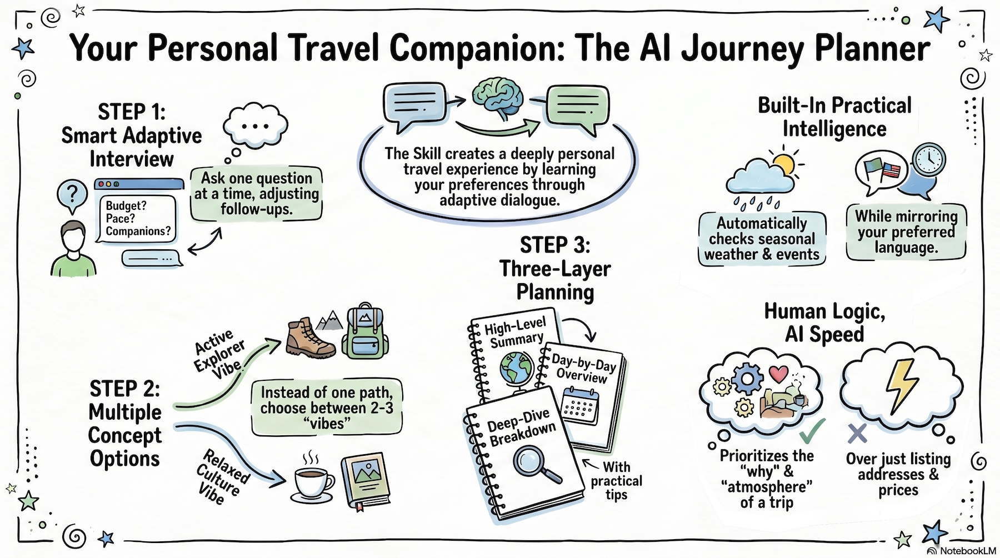

# ✈️ Travel Planning Skill

An adaptive travel planner for AI assistants. Turns vague travel ideas into practical itineraries through intelligent questioning — not guesswork.



## 🎯 The Problem

You have a place in mind. Now you need a plan that actually fits you.

But when you ask AI for help, you get generic lists of places that miss the point.

Most AI travel planners:
- Ask too little, assume too much
- Dump generic "top 10" lists
- Ignore pace, companions, budget, season

This skill fixes that.

## ⚙️ How It Works

**1. 🎤 Adaptive Interview**
One question at a time. Follow-ups adapt to your answers:
- Food interest? → Street food, local spots, or fine dining?
- Budget conscious? → Comfort level
- Nature focus? → Hiking or leisurely walks?
- Specific interests? → Architecture, art, parties or local culture?
- Family trip? → Kids' ages and interests

**2. 🗺️ Route Concepts**
Presents 2-3 genuinely different options:
- Active Explorer vs Relaxed Cultural vs Food-Led Journey
- City Focus vs Nature Escape vs Balanced Mix

**3. 📝 Layered Plan**
- Brief summary
- Day-by-day overview
- Detailed breakdown with tips & alternatives

## 🚀 Usage

Start chat with a natural language request: "I want to plan a 7-day trip to Italy in May".

## 💡 Example

```
User: 6 days in Portugal, September, with partner.

Assistant: What matters most?
A) Food and neighborhoods
B) Coast and scenery
C) History and museums
D) Balanced mix

[... adaptive questions continue ...]

Assistant: Here are 3 route concepts...
```

## 📁 Output

```
travel-plans/YYYY-MM-DD-<destination>-plan.md
```

Optional compact version for quick reference:
```
travel-plans/YYYY-MM-DD-<destination>-compact.md
```

## ✨ Smart Features

- **Mirrors your language** automatically
- **Web search only when needed** — weather, events, seasonal closures
- **Multiple choice questions** — faster than open-ended

## ✅ Best For

- You know where, but not how to structure it
- Comparing travel styles, not just places
- Trips where pace & companions matter

## ❌ Not For

- Booking flights/hotels
- Live pricing
- Map planning
- Instant answers without context

## 📦 Installation

```
npx skills add https://github.com/SwCake1/travel-planning --skill travel-planning
```
**Manual:** Place `travel-planning/` in your skills directory

## 🙏 Credits

Inspired by Jesse Vincent's [Superpowers](https://github.com/obra/superpowers) brainstorming skill.
